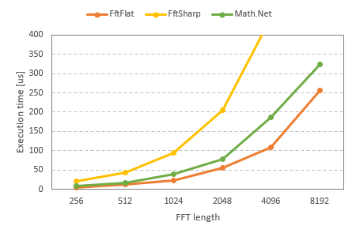

# FftFlat

The purpose of this library is to provide a reasonably fast FFT implementation, entirely in pure C#.
This library is adapted from [General Purpose FFT Package by Ooura](https://www.kurims.kyoto-u.ac.jp/~ooura/fft.html), modified to be compatible with the .NET Standard complex number type.


## Features

* __Fast:__ Twice as fast as the managed FFT implementation in Math.NET Numerics.
* __Lightweight:__ Small code size, with no dependencies other than .NET Standard 2.1.


## Installation

[The NuGet package](https://www.nuget.org/packages/FftFlat) is available:

```ps1
Install-Package FftFlat
```

If you don't want to add a DLL, copy [the .cs files](https://github.com/sinshu/fftflat/tree/main/FftFlat) to your project.


## Usage

First, add a `using` statement for the `FftFlat` namespace.

```cs
using FftFlat;
```

To perform FFT or IFFT, create an instance of `FastFourierTransform` and call the appropriate method.

```cs
var samples = new Complex[1024];
samples[0] = 1;

var fft = new FastFourierTransform(1024);
fft.ForwardInplace(samples);
```


## Important Notices

Ooura's original FFT implementation is based on a different definition from that used in Math.NET Numerics. FFtFlat adjusts this difference, ensuring its results match those of [Math.NET Numerics' FFT](https://numerics.mathdotnet.com/api/MathNet.Numerics.IntegralTransforms/Fourier.htm).

Normalization is only done during the IFFT.
This is similar to using `FourierOptions.AsymmetricScaling` for FFT in Math.NET Numerics.

Note that the `FastFourierTransform` object is not thread-safe.
If performing FFT across multiple threads, ensure a separate instance is provided for each thread.


## Demo

In this demo video, the spectrum is visualized in real-time as sound is played using `AudioStream` of [RayLib-CsLo](https://github.com/NotNotTech/Raylib-CsLo).

https://www.youtube.com/watch?v=KTpG_z_ejZ0  

[](https://www.youtube.com/watch?v=KTpG_z_ejZ0)


## Performance

The following is a benchmark comparing this with other pure C# FFT implementations.
In this benchmark, the time taken to perform FFT and IFFT on a random signal was measured.
The FFT lengths used were powers of two, ranging from 256 to 8192.

| Method   | Length | Mean       | Error     | StdDev    | Gen0   | Allocated |
|--------- |------- |-----------:|----------:|----------:|-------:|----------:|
| **FftFlat**  | **256**    |   **1.528 μs** | **0.0029 μs** | **0.0026 μs** |      **-** |         **-** |
| FftSharp | 256    |  19.160 μs | 0.0760 μs | 0.0711 μs |      - |         - |
| MathNet  | 256    |   7.809 μs | 0.0239 μs | 0.0212 μs |      - |         - |
| **FftFlat**  | **512**    |   **3.657 μs** | **0.0086 μs** | **0.0080 μs** |      **-** |         **-** |
| FftSharp | 512    |  43.115 μs | 0.1461 μs | 0.1367 μs |      - |         - |
| MathNet  | 512    |  16.250 μs | 0.0471 μs | 0.0440 μs |      - |         - |
| **FftFlat**  | **1024**   |   **7.624 μs** | **0.0352 μs** | **0.0294 μs** |      **-** |         **-** |
| FftSharp | 1024   |  93.643 μs | 0.1119 μs | 0.1046 μs |      - |         - |
| MathNet  | 1024   |  39.235 μs | 0.0591 μs | 0.0524 μs | 1.5869 |   20875 B |
| **FftFlat**  | **2048**   |  **17.883 μs** | **0.0602 μs** | **0.0563 μs** |      **-** |         **-** |
| FftSharp | 2048   | 205.152 μs | 0.4467 μs | 0.4179 μs |      - |         - |
| MathNet  | 2048   |  77.048 μs | 0.3446 μs | 0.2878 μs | 1.8311 |   24692 B |
| **FftFlat**  | **4096**   |  **39.643 μs** | **0.3727 μs** | **0.3486 μs** |      **-** |         **-** |
| FftSharp | 4096   | 444.473 μs | 0.6072 μs | 0.5382 μs |      - |         - |
| MathNet  | 4096   | 183.645 μs | 0.7292 μs | 0.6821 μs | 2.4414 |   33076 B |
| **FftFlat**  | **8192**   | **113.593 μs** | **0.6839 μs** | **0.6397 μs** |      **-** |         **-** |
| FftSharp | 8192   | 956.056 μs | 1.3150 μs | 1.2300 μs |      - |       1 B |
| MathNet  | 8192   | 321.394 μs | 0.9518 μs | 0.8437 μs | 3.4180 |   46710 B |




## Todo

* ✅ FFT for power-of-two length samples
* ⬜ FFT for arbitrary length samples
* ⬜ Other transformations (such as cosine transform)
* ⬜ Support for 32-bit floating-point numbers


## License

FftFlat is available under [the MIT license](LICENSE.md).
