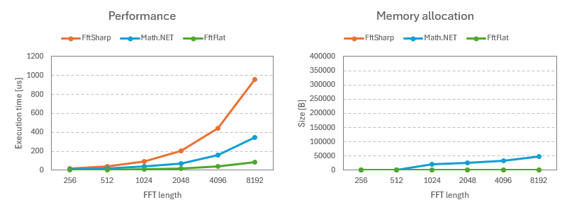
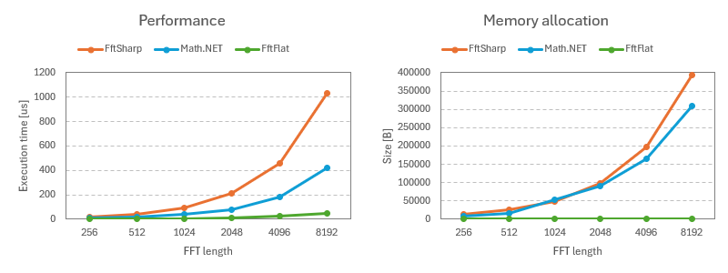

# FftFlat

The purpose of this library is to provide a fast FFT implementation, entirely in pure C#.
This library is adapted from [General Purpose FFT Package by Ooura](https://www.kurims.kyoto-u.ac.jp/~ooura/fft.html), modified to be compatible with the .NET Standard complex number type.


## Features

* __Fast:__ More than four times as fast as the managed FFT implementation in Math.NET Numerics.
* __Lightweight:__ Small code size, with no dependencies other than .NET Standard 2.1.


## Installation

[The NuGet package](https://www.nuget.org/packages/FftFlat) is available:

```ps1
Install-Package FftFlat
```

If you don't want to add a DLL, copy [the .cs files](https://github.com/sinshu/fftflat/tree/main/FftFlat) to your project.


## Usage

First, add a `using` statement for the `FftFlat` namespace.

```cs
using FftFlat;
```

To perform FFT or IFFT, create an instance of `FastFourierTransform` and call the appropriate method.

```cs
var samples = new Complex[1024];
samples[0] = 1;

var fft = new FastFourierTransform(1024);
fft.Forward(samples);
```


## Important Notices

Ooura's original FFT implementation is based on a different definition from that used in Math.NET Numerics. FFtFlat adjusts this difference, ensuring its results match those of [Math.NET Numerics' FFT](https://numerics.mathdotnet.com/api/MathNet.Numerics.IntegralTransforms/Fourier.htm).

Normalization is only done during the IFFT.
This is similar to using `FourierOptions.AsymmetricScaling` for FFT in Math.NET Numerics.

Note that the `FastFourierTransform` object is not thread-safe.
If performing FFT across multiple threads, ensure a separate instance is provided for each thread.


## Demo

In this demo video, the spectrum is visualized in real-time as sound is played using `AudioStream` of [RayLib-CsLo](https://github.com/NotNotTech/Raylib-CsLo).

https://www.youtube.com/watch?v=KTpG_z_ejZ0  

[](https://www.youtube.com/watch?v=KTpG_z_ejZ0)


## Performance

The following is a benchmark comparing this with other pure C# FFT implementations.
In this benchmark, the time taken to perform FFT and IFFT on a random signal was measured.
The FFT lengths used were powers of two, ranging from 256 to 8192.

### Complex FFT

| Method   | Length | Mean         | Error     | StdDev    | Median       | Gen0    | Gen1    | Gen2    | Allocated |
|--------- |------- |-------------:|----------:|----------:|-------------:|--------:|--------:|--------:|----------:|
| FftFlat  | 2048   |    17.664 μs | 0.0444 μs | 0.0415 μs |    17.664 μs |       - |       - |       - |         - |
| FftSharp | 2048   |   203.196 μs | 0.6797 μs | 0.6358 μs |   203.137 μs |       - |       - |       - |         - |
| MathNet  | 2048   |    71.875 μs | 0.5197 μs | 0.4340 μs |    71.836 μs |  1.9531 |       - |       - |   25660 B |
| FftFlat  | 4096   |    36.990 μs | 0.2119 μs | 0.1983 μs |    37.014 μs |       - |       - |       - |         - |
| FftSharp | 4096   |   439.636 μs | 1.4182 μs | 1.3265 μs |   439.750 μs |       - |       - |       - |         - |
| MathNet  | 4096   |   157.341 μs | 0.6241 μs | 0.5211 μs |   157.270 μs |  2.4414 |       - |       - |   33650 B |
| FftFlat  | 8192   |    83.777 μs | 0.1272 μs | 0.1128 μs |    83.769 μs |       - |       - |       - |         - |
| FftSharp | 8192   |   954.118 μs | 2.7325 μs | 2.5560 μs |   953.749 μs |       - |       - |       - |         - |
| MathNet  | 8192   |   343.381 μs | 5.1914 μs | 4.8561 μs |   339.598 μs |  3.4180 |       - |       - |   47481 B |



### Real FFT

| Method   | Length | Mean         | Error     | StdDev    | Median       | Gen0    | Gen1    | Gen2    | Allocated |
|--------- |------- |-------------:|----------:|----------:|-------------:|--------:|--------:|--------:|----------:|
| FftFlat  | 2048   |    10.303 μs | 0.0359 μs | 0.0336 μs |    10.296 μs |       - |       - |       - |         - |
| FftSharp | 2048   |   208.290 μs | 0.6072 μs | 0.5679 μs |   208.354 μs |  7.3242 |  0.7324 |       - |   98416 B |
| MathNet  | 2048   |    77.546 μs | 0.5357 μs | 0.4749 μs |    77.576 μs |  7.0801 |  0.8545 |       - |   90663 B |
| FftFlat  | 4096   |    22.647 μs | 0.1032 μs | 0.0966 μs |    22.640 μs |       - |       - |       - |         - |
| FftSharp | 4096   |   454.185 μs | 1.5450 μs | 1.4452 μs |   454.305 μs | 14.6484 |  3.4180 |       - |  196720 B |
| MathNet  | 4096   |   179.540 μs | 1.2277 μs | 1.1484 μs |   179.667 μs | 12.6953 |  2.9297 |       - |  165035 B |
| FftFlat  | 8192   |    47.374 μs | 0.2011 μs | 0.1881 μs |    47.337 μs |       - |       - |       - |         - |
| FftSharp | 8192   | 1,034.310 μs | 3.5584 μs | 3.1544 μs | 1,034.975 μs | 82.0313 | 82.0313 | 82.0313 |  393356 B |
| MathNet  | 8192   |   417.383 μs | 0.5965 μs | 0.5288 μs |   417.317 μs | 83.0078 | 83.0078 | 83.0078 |  309285 B |




## Todo

* ✅ FFT for power-of-two length samples
* ✅ Real FFT
* ⬜ Other transformations (such as cosine transform)
* ⬜ Support for 32-bit floating-point numbers
* ⬜ FFT for arbitrary length samples


## License

FftFlat is available under [the MIT license](LICENSE.md).
